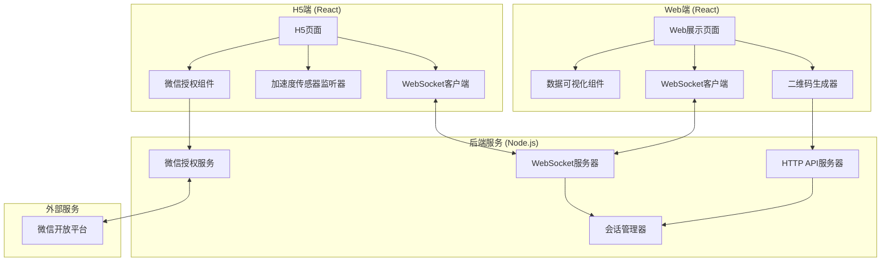

# 设计文档

## 概述

公司抽奖系统是一个基于实时通信的分布式Web应用，采用客户端-服务器架构。系统由三个主要部分组成：Web展示端（React）、移动端H5页面（React）和后端服务（Node.js + WebSocket）。通过WebSocket实现Web端和多个H5端之间的实时双向通信，集成微信OAuth 2.0获取用户身份信息，使用设备加速度传感器捕获摇动数据。

## 架构

### 系统架构图



### 技术栈

**前端**:
- React 18+ (Web端和H5端)
- Socket.io-client (WebSocket客户端)
- QRCode.js (二维码生成)
- Chart.js 或 ECharts (数据可视化)
- Axios (HTTP请求)

**后端**:
- Node.js 18+
- Express (HTTP服务器)
- Socket.io (WebSocket服务器)
- UUID (会话ID生成)

**部署**:
- HTTPS (SSL/TLS加密)
- 支持跨域CORS配置

## 组件和接口

### 1. Web端组件

#### 1.1 主页面组件 (MainPage)

**职责**: 管理整个抽奖流程的主界面

**状态**:
```typescript
interface MainPageState {
  sessionId: string | null;
  qrCodeUrl: string | null;
  participants: Participant[];
  lotteryStatus: 'idle' | 'waiting' | 'running' | 'finished';
  countdown: number;
  winners: Winner[];
}
```

**方法**:
- `createSession()`: 创建新的抽奖会话
- `startLottery()`: 开始抽奖
- `handleParticipantJoin(participant)`: 处理新参与者加入
- `handleShakeData(data)`: 处理摇动数据更新
- `calculateWinners()`: 计算中奖者

#### 1.2 参与者列表组件 (ParticipantList)

**职责**: 显示所有参与者的信息

**Props**:
```typescript
interface ParticipantListProps {
  participants: Participant[];
}
```

**渲染内容**:
- 参与者头像
- 参与者昵称
- 参与状态指示器

#### 1.3 实时数据图表组件 (ShakeChart)

**职责**: 实时显示参与者摇动数据的柱状图

**Props**:
```typescript
interface ShakeChartProps {
  participants: Participant[];
  shakeData: Map<string, number>;
}
```

**功能**:
- 动态更新柱状图高度
- 按摇动次数排序
- 高亮显示前三名

#### 1.4 中奖结果组件 (WinnerDisplay)

**职责**: 展示中奖者信息

**Props**:
```typescript
interface WinnerDisplayProps {
  winners: Winner[];
}
```

**渲染内容**:
- 第一名、第二名、第三名标识
- 中奖者头像和昵称
- 摇动次数

### 2. H5端组件

#### 2.1 授权页面组件 (AuthPage)

**职责**: 引导用户完成微信授权

**状态**:
```typescript
interface AuthPageState {
  authStatus: 'pending' | 'authorizing' | 'success' | 'failed';
  userInfo: WeChatUserInfo | null;
  errorMessage: string | null;
}
```

**方法**:
- `requestWeChatAuth()`: 请求微信授权
- `handleAuthCallback(code)`: 处理授权回调
- `submitUserInfo()`: 提交用户信息到服务器

#### 2.2 摇一摇页面组件 (ShakePage)

**职责**: 监听设备传感器并显示摇动状态

**状态**:
```typescript
interface ShakePageState {
  shakeStatus: 'waiting' | 'shaking' | 'stopped';
  shakeCount: number;
  isWinner: boolean;
  rank: number | null;
}
```

**方法**:
- `startShakeListener()`: 开始监听加速度传感器
- `stopShakeListener()`: 停止监听
- `calculateShakeSpeed(acceleration)`: 计算摇动速度
- `sendShakeData()`: 发送摇动数据到服务器

#### 2.3 传感器监听器 (ShakeSensor)

**职责**: 封装设备加速度传感器的访问

**接口**:
```typescript
interface ShakeSensor {
  start(callback: (shakeCount: number) => void): void;
  stop(): void;
  isSupported(): boolean;
}
```

**实现逻辑**:
- 监听 `devicemotion` 事件
- 计算加速度变化量
- 识别摇动动作（加速度阈值判断）
- 累计摇动次数

### 3. 后端服务组件

#### 3.1 HTTP API服务器

**端点**:

```typescript
// 创建抽奖会话
POST /api/session/create
Response: {
  sessionId: string;
  qrCodeData: string;
  expiresAt: number;
}

// 获取会话信息
GET /api/session/:sessionId
Response: {
  sessionId: string;
  status: string;
  participantCount: number;
}

// 微信授权回调
GET /api/wechat/callback?code=xxx&state=sessionId
Response: {
  userInfo: WeChatUserInfo;
  sessionId: string;
}
```

#### 3.2 WebSocket服务器

**事件定义**:

```typescript
// 客户端 -> 服务器
interface ClientEvents {
  'join-session': (data: { sessionId: string; clientType: 'web' | 'h5' }) => void;
  'user-authorized': (data: { sessionId: string; userInfo: WeChatUserInfo }) => void;
  'start-lottery': (data: { sessionId: string; duration: number }) => void;
  'shake-data': (data: { sessionId: string; userId: string; shakeCount: number }) => void;
}

// 服务器 -> 客户端
interface ServerEvents {
  'session-joined': (data: { success: boolean; message?: string }) => void;
  'participant-joined': (data: { participant: Participant }) => void;
  'lottery-started': (data: { duration: number; startTime: number }) => void;
  'lottery-stopped': () => void;
  'shake-update': (data: { userId: string; shakeCount: number }) => void;
  'lottery-result': (data: { winners: Winner[] }) => void;
  'error': (data: { message: string }) => void;
}
```

#### 3.3 会话管理器 (SessionManager)

**职责**: 管理抽奖会话的生命周期和数据

**接口**:
```typescript
interface SessionManager {
  createSession(): Session;
  getSession(sessionId: string): Session | null;
  addParticipant(sessionId: string, participant: Participant): void;
  updateShakeData(sessionId: string, userId: string, shakeCount: number): void;
  calculateWinners(sessionId: string): Winner[];
  deleteSession(sessionId: string): void;
}
```

**数据结构**:
```typescript
interface Session {
  id: string;
  createdAt: number;
  status: 'waiting' | 'running' | 'finished';
  participants: Map<string, Participant>;
  shakeData: Map<string, number>;
  webClient: SocketId | null;
  h5Clients: Set<SocketId>;
}
```

#### 3.4 微信授权服务 (WeChatAuthService)

**职责**: 处理微信OAuth 2.0授权流程

**接口**:
```typescript
interface WeChatAuthService {
  getAuthUrl(sessionId: string): string;
  handleCallback(code: string): Promise<WeChatUserInfo>;
  refreshAccessToken(refreshToken: string): Promise<string>;
}
```

**OAuth流程**:
1. 生成授权URL（包含appId、redirectUri、state）
2. 用户同意授权后，微信重定向到回调URL
3. 使用授权码换取access_token
4. 使用access_token获取用户信息
5. 返回用户信息（openid、昵称、头像）

## 数据模型

### 参与者 (Participant)

```typescript
interface Participant {
  userId: string;          // 微信openid
  nickname: string;        // 微信昵称
  avatarUrl: string;       // 微信头像URL
  joinedAt: number;        // 加入时间戳
  socketId: string;        // WebSocket连接ID
}
```

### 摇动数据 (ShakeData)

```typescript
interface ShakeData {
  userId: string;          // 用户ID
  shakeCount: number;      // 累计摇动次数
  lastUpdateTime: number;  // 最后更新时间
}
```

### 中奖者 (Winner)

```typescript
interface Winner {
  rank: 1 | 2 | 3;         // 名次
  userId: string;          // 用户ID
  nickname: string;        // 昵称
  avatarUrl: string;       // 头像URL
  shakeCount: number;      // 摇动次数
}
```

### 微信用户信息 (WeChatUserInfo)

```typescript
interface WeChatUserInfo {
  openid: string;          // 微信openid
  nickname: string;        // 昵称
  headimgurl: string;      // 头像URL
  unionid?: string;        // unionid（可选）
}
```

### 会话配置 (SessionConfig)

```typescript
interface SessionConfig {
  duration: number;        // 抽奖时长（秒）
  maxParticipants: number; // 最大参与人数
  winnerCount: number;     // 中奖人数（默认3）
}
```

## 正确性属性

*属性是一个特征或行为，应该在系统的所有有效执行中保持为真——本质上是关于系统应该做什么的形式化陈述。属性是人类可读规范和机器可验证正确性保证之间的桥梁。*


### 属性反思

在编写具体属性之前，让我审查预分析中识别的可测试属性，消除冗余：

**冗余分析**:
- 属性1.1（会话ID唯一性）和属性10.1（会话ID唯一且不可预测）可以合并为一个更全面的属性
- 属性2.3（授权返回必需字段）和属性9.5（授权服务返回必需字段）是重复的，可以合并
- 属性7.1（计算排名）和属性7.2（选出前三名）逻辑上相关，7.2包含了7.1的验证
- 属性8.1（建立连接）和属性8.2（加入会话）是连续步骤，可以合并为一个连接流程属性

**合并后的属性列表**:
- 会话管理：会话ID唯一性和不可预测性、会话数据清理、会话隔离
- 用户授权：授权返回完整信息、用户信息传输、重复用户识别
- 实时通信：消息路由、广播到所有客户端、连接和加入会话
- 抽奖流程：开始指令广播、倒计时配置、停止指令发送
- 摇动数据：传感器监听、数据计算、数据传输、数据更新
- 数据展示：参与者信息渲染、图表数据更新、排序显示
- 中奖计算：选出前三名、结果推送、结果渲染

### 正确性属性列表

**属性 1: 会话ID唯一性和不可预测性**

*对于任意*多次会话创建操作，生成的所有会话ID应该是唯一的，且使用UUID格式（不可预测）

**验证需求: 1.1, 10.1**

**属性 2: 二维码包含会话ID**

*对于任意*有效的会话，生成的二维码数据应该包含该会话的ID

**验证需求: 1.2**

**属性 3: 会话数据清理**

*对于任意*会话，当会话结束后，查询该会话应该返回空或不存在

**验证需求: 1.4**

**属性 4: 授权服务返回完整用户信息**

*对于任意*成功的微信授权响应，返回的用户信息应该包含openid、昵称和头像URL三个必需字段

**验证需求: 2.3, 9.5**

**属性 5: 用户信息传输到服务器**

*对于任意*获取成功的用户信息，H5端应该将该信息发送到实时通信服务

**验证需求: 2.4**

**属性 6: 消息路由到正确会话**

*对于任意*会话和用户信息，当实时通信服务接收到该用户信息时，应该将其推送到该会话的Web端客户端

**验证需求: 3.1**

**属性 7: 参与者列表渲染包含必需信息**

*对于任意*参与者，渲染的参与者列表项应该包含昵称和头像URL

**验证需求: 3.2**

**属性 8: 重复用户不被重复添加**

*对于任意*用户和会话，当同一用户（相同openid）多次加入时，参与者列表中应该只有一个该用户的记录

**验证需求: 3.4**

**属性 9: 开始指令广播到所有H5端**

*对于任意*会话，当发送开始抽奖指令时，该会话中的所有H5端客户端都应该收到开始指令

**验证需求: 4.1**

**属性 10: 开始抽奖启动倒计时**

*对于任意*开始抽奖操作，倒计时器应该被启动且初始值等于配置的抽奖时长

**验证需求: 4.2**

**属性 11: 倒计时结束发送停止指令**

*对于任意*会话，当倒计时结束时，应该向该会话的所有H5端客户端发送停止指令

**验证需求: 4.4**

**属性 12: 抽奖时长可配置**

*对于任意*有效的时长值（正整数），系统应该接受该配置并使用它作为倒计时时长

**验证需求: 4.5**

**属性 13: 接收开始指令后启动传感器监听**

*对于任意*H5端客户端，当接收到开始指令时，应该启动加速度传感器监听器

**验证需求: 5.2**

**属性 14: 摇动数据计算**

*对于任意*加速度传感器数据序列，摇动检测算法应该正确计算出摇动次数（基于加速度阈值）

**验证需求: 5.3**

**属性 15: 摇动数据传输到Web端**

*对于任意*计算完成的摇动数据，H5端应该通过实时通信服务将数据发送到Web端

**验证需求: 5.4**

**属性 16: 接收停止指令后停止监听**

*对于任意*H5端客户端，当接收到停止指令时，应该停止加速度传感器监听器

**验证需求: 5.5**

**属性 17: 摇动数据更新图表**

*对于任意*接收到的摇动数据，Web端应该更新对应参与者的图表数据

**验证需求: 6.1**

**属性 18: 图表渲染包含完整信息**

*对于任意*参与者，图表中该参与者的显示应该包含昵称、头像和当前摇动次数

**验证需求: 6.3**

**属性 19: 摇动数据按次数排序**

*对于任意*摇动数据集合，显示时应该按照摇动次数从高到低排序

**验证需求: 6.5**

**属性 20: 选出摇动次数最多的前三名**

*对于任意*参与者和摇动数据集合，中奖者应该是摇动次数最多的前三名参与者（如果参与者少于三人，则为实际人数）

**验证需求: 7.1, 7.2**

**属性 21: 中奖结果渲染包含名次标识**

*对于任意*中奖者列表，渲染结果应该为每个中奖者显示其名次（第一名、第二名、第三名）

**验证需求: 7.4**

**属性 22: 中奖结果推送到所有H5端**

*对于任意*会话和中奖结果，应该向该会话的所有H5端客户端推送中奖结果

**验证需求: 7.5**

**属性 23: H5端显示中奖状态和名次**

*对于任意*用户和中奖结果，H5端渲染应该显示该用户是否中奖以及获得的名次（如果中奖）

**验证需求: 7.6**

**属性 24: WebSocket连接建立并加入会话**

*对于任意*客户端连接请求，实时通信服务应该建立WebSocket连接并将客户端加入指定的会话

**验证需求: 8.1, 8.2**

**属性 25: 会话内消息广播**

*对于任意*会话和广播消息，该会话中的所有客户端都应该收到该消息

**验证需求: 8.6**

**属性 26: 生成微信授权URL**

*对于任意*授权请求，微信授权服务应该生成包含appId、redirectUri和state参数的授权URL

**验证需求: 9.1**

**属性 27: 授权码换取access_token**

*对于任意*有效的授权码，微信授权服务应该能够换取到access_token

**验证需求: 9.3**

**属性 28: 会话ID有效性验证**

*对于任意*加入会话请求，系统应该验证会话ID是否存在且有效，无效的会话ID应该被拒绝

**验证需求: 10.2**

**属性 29: 会话消息隔离**

*对于任意*两个不同的会话A和B，发送到会话A的消息不应该被会话B的客户端接收到

**验证需求: 10.3**

## 错误处理

### 1. 网络错误处理

**WebSocket断线重连**:
- 检测连接断开事件
- 实施指数退避重连策略（1s, 2s, 4s）
- 最多重连3次
- 重连失败后提示用户刷新页面

**HTTP请求失败**:
- 捕获网络错误和超时
- 显示用户友好的错误提示
- 提供重试选项

### 2. 授权错误处理

**用户拒绝授权**:
- 显示"需要授权才能参与抽奖"提示
- 提供重新授权按钮
- 阻止未授权用户参与

**授权过期**:
- 检测access_token过期
- 使用refresh_token刷新
- 刷新失败时引导用户重新授权

**授权服务不可用**:
- 捕获微信API错误
- 显示"服务暂时不可用"提示
- 记录错误日志供排查

### 3. 设备兼容性错误

**传感器不支持**:
- 检测设备是否支持加速度传感器
- 不支持时显示"您的设备不支持摇一摇功能"
- 建议使用其他设备参与

**浏览器不兼容**:
- 检测WebSocket支持
- 不支持时显示升级浏览器提示

### 4. 业务逻辑错误

**会话不存在**:
- 验证会话ID有效性
- 无效时显示"抽奖活动不存在或已结束"
- 引导用户联系组织者

**会话已结束**:
- 检测会话状态
- 已结束时阻止新用户加入
- 显示"抽奖已结束"提示

**重复参与**:
- 检测用户是否已加入
- 已加入时显示"您已参与本次抽奖"
- 保持现有连接

### 5. 数据验证错误

**无效的摇动数据**:
- 验证摇动次数为非负整数
- 验证数据时间戳合理性
- 拒绝异常数据并记录日志

**无效的用户信息**:
- 验证必需字段存在
- 验证字段格式正确
- 拒绝不完整的用户信息

## 测试策略

### 双重测试方法

本系统采用**单元测试**和**基于属性的测试**相结合的方法，确保全面的代码覆盖和正确性验证。

**单元测试**:
- 验证特定示例和边缘情况
- 测试错误条件和异常处理
- 测试组件集成点
- 使用Jest作为测试框架

**基于属性的测试**:
- 验证跨所有输入的通用属性
- 通过随机化实现全面的输入覆盖
- 使用fast-check库（JavaScript/TypeScript的属性测试库）
- 每个属性测试运行最少100次迭代

**测试平衡**:
- 单元测试关注具体场景和边缘情况
- 属性测试关注通用规则和不变量
- 避免过多单元测试，让属性测试处理大量输入覆盖
- 单元测试和属性测试互补，共同确保全面覆盖

### 测试配置

**属性测试标记格式**:
```typescript
// Feature: company-lottery-system, Property 1: 会话ID唯一性和不可预测性
test('session IDs should be unique and unpredictable', () => {
  fc.assert(
    fc.property(fc.nat(100), (count) => {
      // 测试逻辑
    }),
    { numRuns: 100 }
  );
});
```

### 测试覆盖范围

**前端测试**:
1. 组件渲染测试（单元测试）
   - 参与者列表渲染
   - 图表组件渲染
   - 中奖结果显示

2. WebSocket通信测试（属性测试）
   - 消息发送和接收
   - 连接和断线处理
   - 会话加入和退出

3. 传感器数据处理测试（属性测试）
   - 摇动检测算法
   - 数据计算准确性
   - 边缘情况处理

**后端测试**:
1. 会话管理测试（属性测试）
   - 会话创建和删除
   - 会话ID唯一性
   - 会话隔离

2. 实时通信测试（属性测试）
   - 消息路由
   - 广播功能
   - 会话内通信隔离

3. 中奖计算测试（属性测试）
   - 排名算法正确性
   - 前三名选择
   - 边缘情况（少于3人）

4. 微信授权测试（单元测试 + Mock）
   - 授权URL生成
   - Token交换
   - 用户信息获取
   - 错误处理

**集成测试**:
1. 端到端流程测试
   - 完整抽奖流程
   - 多用户并发参与
   - 实时数据同步

2. 性能测试
   - 并发用户数测试
   - 消息延迟测试
   - 系统负载测试

### 测试工具

- **Jest**: JavaScript测试框架
- **fast-check**: 属性测试库
- **React Testing Library**: React组件测试
- **Socket.io-client**: WebSocket客户端测试
- **Supertest**: HTTP API测试
- **Mock Service Worker (MSW)**: API Mock

### 持续集成

- 所有测试在CI/CD管道中自动运行
- 代码覆盖率目标：80%以上
- 属性测试失败时记录反例供调试
- 性能测试定期运行以监控系统性能
